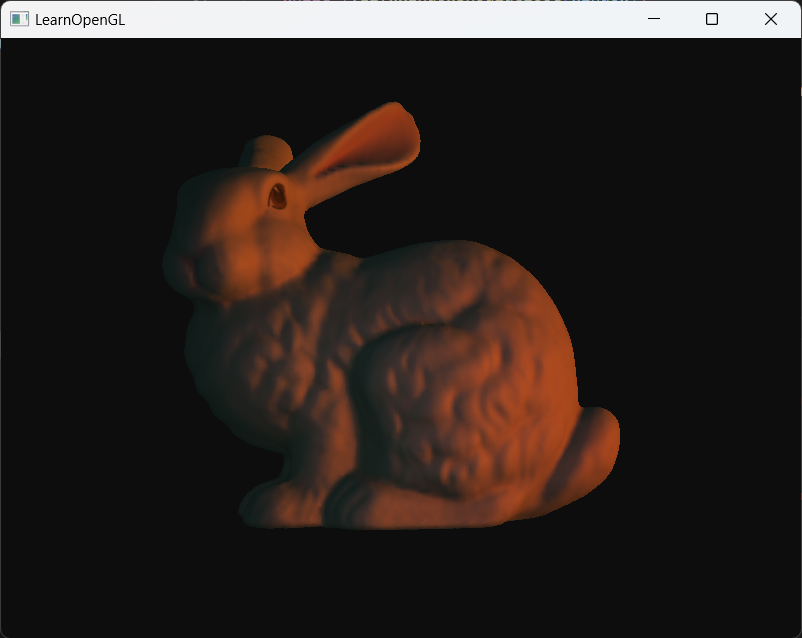

# OpenGL Template



## how to build
This project is for VScode + MinGW so you can get rid of Visual Studio :);

You'll need [MinGW](https://code.visualstudio.com/docs/cpp/config-mingw) and [CMake](https://code.visualstudio.com/docs/cpp/cmake-linux) to build and compile your project. Check VScode Document for more information.

+ Download this repository and open it in VScode.
```
    cd PATH_TO_YOUR_PROJECT_FOLDER
    git clone https://github.com/theamusing/OpenGL_Template.git 
    cd OpenGL_Template
    code .
```
+ Create a **/bin** folder, and drag all the .dll files from **/dll** folder to the **/bin** folder.
+ Download CMake extension for VScode. Click Configure and Build.
+ Your executable file will be generated in the **/bin** folder. Run it.

## features
This repository contains basic camera controller, model loading system(thanks to [learnOpenGL](https://github.com/JoeyDeVries/LearnOpenGL)) and lighting system.

Since the repository is based on GL 4.6, it support **#include** grammer in glsl shaders. For eaxmple, if you want to use lighting system in your own shader, you can just include the light.glsl and don't need to write your own. But be aware that all your include file path in your shaders should start with '/'. Check [model_lighting.fs](resources/shaders/model_lighting.fs) and [shaders.hpp](include/opengl/shader.hpp) for more information.

This repository is really lightweight, you can easyly build your own features on it.

## potential issues
This repository uses pre-compiled Assimp library to load models. If Assimp doesn't work in your own environment, you may need to compile your own Assimp.

You can find the latest released Assimp library [here](https://github.com/assimp/assimp/releases). You can use CMake to build it, and choose MinGW to compile it. Replace the Assimp [include files](./include/assimp/) and dll file with your own version. 

[Here](https://learnopengl.com/Model-Loading/Assimp) is a tutorial on how to compile your Assimp library.

*Notice, some include files are generated in the CMake output folder after compilation(like config.h and division.h), so don't forget to add them.*

## some kind tips
When using Shader Storage Buffer, remember to align your data structure to 16 bytes(see [light.hpp](include/opengl/light.hpp)), or the shader can't read data correctly.