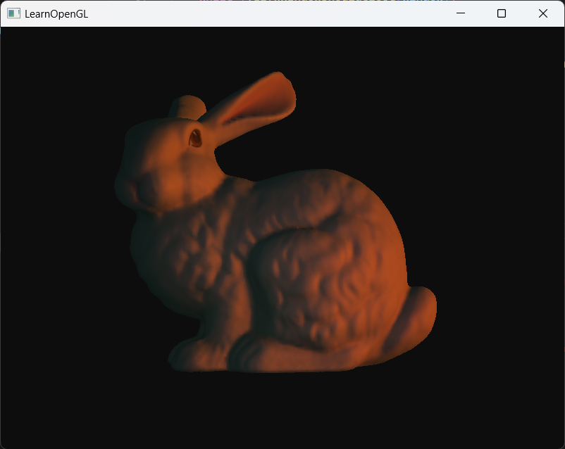

# OpenGL 模板



## 如何构建
这个项目适用于 VScode + MinGW，从此告别 Visual Studio :);

你需要用到 [MinGW](https://code.visualstudio.com/docs/cpp/config-mingw) 和 [CMake](https://code.visualstudio.com/docs/cpp/cmake-linux) 来构建和编译这个项目。更多信息请查看 VScode 文档。

+ clone此仓库到本地并在 VScode 中打开
```
    cd PATH_TO_YOUR_PROJECT_FOLDER
    git clone https://github.com/theamusing/OpenGL_Template.git 
    cd OpenGL_Template
    code .
```
+ 创建一个 **/bin** 文件夹，并将 **/dll** 文件夹中的所有 .dll 文件拖到 **/bin** 文件夹中。
+ 下载 VScode 的 CMake 扩展，点击配置并构建。
+ 你的可执行文件将生成在 **/bin** 文件夹中。

## 功能
此仓库包含基本的相机控制器、模型加载系统（感谢 [learnOpenGL](https://github.com/JoeyDeVries/LearnOpenGL)）和照明系统。

该仓库基于 GL 4.6，因此支持在 glsl 着色器中使用 **#include** 语法。例如，如果你想在自己的着色器中使用光照系统，可以直接使用 **#include "/include/light.glsl"** 而不需要重复编写。

*注意，你的所有包含文件路径应以 '/'开头。有关更多信息，请查看 [model_lighting.fs](resources/shaders/model_lighting.fs) 和 [shaders.hpp](include/opengl/shader.hpp)。*

由于这个仓库非常轻量级，你可以轻松地在其基础上构建自己的功能。

## 潜在问题
此仓库使用预编译的 Assimp 库来加载模型。如果 Assimp 在你的环境里无法正确运行，你需要自己编译。

你可以在 [这里](https://github.com/assimp/assimp/releases) 找到最新的 Assimp 库。使用CMake来构建，同时记得选择平台为MinGW。用你自己编译的文件替换Assimp库的 include文件 和 dll文件。

[这里](https://learnopengl.com/Model-Loading/Assimp) 有一个关于如何编译 Assimp 库的教程。

*注意，一些 include 文件是在编译后的 CMake 输出文件夹中生成的（如 config.h 和 division.h）不要忘记添加它们。*

## 一些小提示
使用着色器存储缓冲区(Shader Storage Buffer)时，记得把数据结构对齐到 16 字节（参见 [light.hpp](include/opengl/light.hpp)），否则着色器无法正确读取数据。
